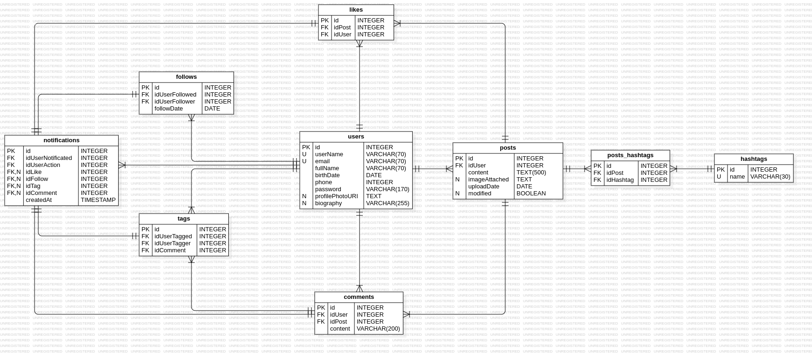

# GreenForge - Backend En desarrollo

## Descripción del Proyecto
GreenForge es una red social diseñada para permitir a los usuarios compartir pensamientos, interactuar y mantenerse conectados de manera dinámica. La plataforma soporta publicaciones con texto e imágenes, comentarios, reacciones y sistema de seguidores.

Este repositorio contiene el backend desarrollado en **Spring Boot** bajo una **arquitectura hexagonal**, garantizando modularidad y mantenibilidad.

## Arquitectura del Backend
GreenForge sigue el modelo de arquitectura hexagonal para separar las capas y facilitar futuras extensiones.

- **Capa de Dominio**: Contiene entidades y lógica de negocio.
- **Capa de Aplicación**: Implementa los casos de uso.
- **Capa de Infraestructura**: Maneja la persistencia, controladores REST y seguridad.
- **Adaptadores**: Conectan la lógica central con fuentes de datos y APIs externas.

## Tecnologías Utilizadas
- **Java 17**
- **Spring Boot 3.2.3**
- **Spring Data JPA (con Hibernate)**
- **Spring Security con JWT**
- **PostgreSQL**
- [**Swagger para documentación de API**](GreenForge_API_Docs.pdf)
- **Maven como gestor de dependencias**

## Instalación y Configuración
### Requisitos previos
- Java 17
- Maven
- PostgreSQL

### Configuración
1. Clonar el repositorio:
   ```sh
   git clone https://github.com/KevinJGV/greenForge_SocialNetwork_Back.git
   cd greenForge_SocialNetwork_Back
   code .
   ```

2. Configurar la base de datos en haciendo uso de `application.properties`:
   ```properties
   spring.datasource.url=jdbc:postgresql://localhost:5432/greenforge
   spring.datasource.username=tu_usuario
   spring.datasource.password=tu_contraseña
   ```

3. Ejecutar la aplicación

## Autenticación y Seguridad
- **JWT (JSON Web Token)** para autenticación segura.
- **BCrypt** para el cifrado de contraseñas.
- Validación de edad para restringir el registro a usuarios mayores de 14 años.

## Modelo de Base de Datos


## Repositorio del Frontend
Puedes encontrarlo en: [Repositorio Frontend](https://github.com/KevinJGV/greenForge_SocialNetwork_Front.git)
Hash: `4a53066fa2e610fe8c809d502d03d04bf4594a22`